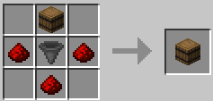
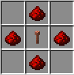
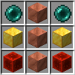
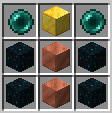
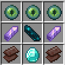
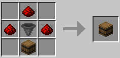

# Networks

DemocracyCraft has one of the most expansive in-game player-to-player economies on Minecraft, this naturally means a lot of shops to buy from and sell to. 

However, with several thousand entities in-game, this becomes laggy for the players more than it does for the server. For that reason, we've implemented a networking system to sort and filter your chests **without** the use of hoppers!

## Create your components
In any network, you will need **input, sorting and miscellaneous** containers, and a **network wand** to configure them.

### Network Wand
This wand will be used to configure the filters for your sorting containers, and view more information about your network components.
- **Right Click** on any network container with the wand in your main hand to view details.
- **Sneak + Left Click** on any sorting container to add a filter.
  - You must have the item you are filtering in your off-hand, and the wand in your main hand.
  - The sorting container will "filter" the item you specified in your off-hand, by grabbing them from input containers that are part of the same network.
- **Left Click** to toggle the wand to Priority mode, or back to Filter mode.
  - If you are in Priority mode, you can choose which sorting containers are to be filled the quickest. 
    - **Shift + Right Click** with the wand to increase the priority of a container.
    - **Shift + Left Click** with the wand to decrease the priority of a container.

#### Recipe

### Containers
See below for a description per container type.

:::tip Containers are not just barrels
You can *also* use Hoppers, Dispensers, and Droppers, just swap out the **Barrel** in the recipes below.
:::

#### Input Containers
These containers are the start of your network, and require the least configuration. You put any items in here for them to be sorted into your sorting containers.

##### Recipe

#### Sorting Containers
These containers look at your input containers and take items from them according to their set filters. You can use the **Network Wand** to set these filters.

On their own, **without filters**, sorting container will remain empty. You need to specify your filters!

##### Recipe

#### Miscellaneous Containers
These containers look for items that haven't been assigned to sorting chests, and takes them. This is useful for when you want to put a bunch of random items in your input containers and filter out rubbish.

### Upgrades
You are able to upgrade the range of your containers using ``Upgrade Antennas``! Craft them using the below recipes, then **right click with then in your hand** to the container you want upgraded, to extend their range. 

:::tip 
You cannot apply the same Tier upgrade more than once. This is a good way to check what Tier a current container is on (until we make an easier method).
:::

#### Tier 1 (50 blocks)
- Requires no prior tiers.

#### Tier 2 (100 blocks)
- Requires Tier 1.

#### Tier 3 (500 blocks)
- Requires Tier 2.

#### Tier 4 (Multi-dimensional)
- Requires Tier 2.

##### Recipe

## How do I create my first network?
Run the command ``/net create <network_name>``, please use a descriptive name for your reference! You can then place down the containers you crafted, and use your Network Wand on them.

:::tip Need to edit a network?
Do ``/net select <network_name>``, then place your containers and use your Network Wand to your heart's desire!
:::

## All Available Commands
- ``/net create <name>`` - Create a storage network.

- ``/net delete <name>`` - Delete a storage network.

- ``/net rename <name> <newName>`` - Rename a network.

- ``/net select <name>`` - Select a storage network.

- ``/net list`` - List all networks you have permissions for.

- ``/net info`` - Show information about the selected network.

- ``/net items`` - List all your network's items.

- ``/net user add <player>`` - Give or revoke a player access to your network.